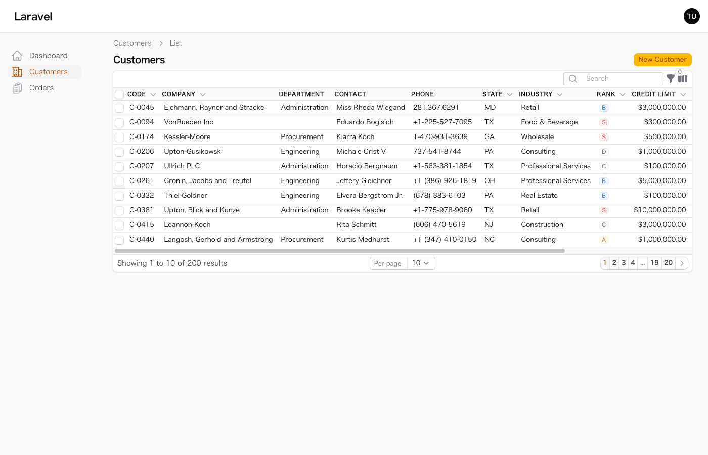
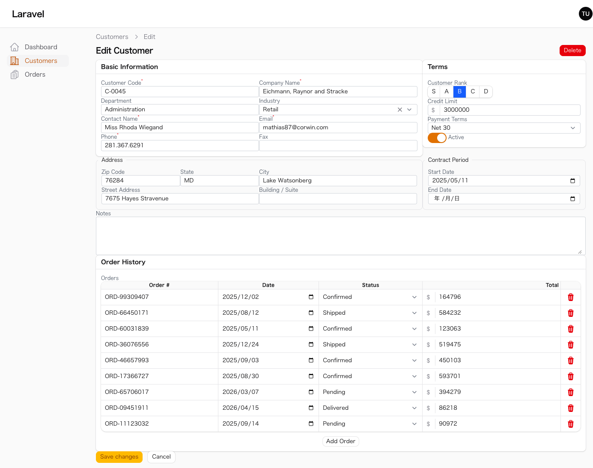

# Bonsai Theme

High-density, compact UI theme for Filament v5.

Inspired by Japanese business applications (sales, inventory, order management) that prioritize information density, Bonsai Theme reduces padding, gaps, and font sizes across all Filament components to fit more data on screen.

## Installation

```bash
composer require qalainau/bonsai-theme
```

## Usage

Register the plugin in your panel provider:

```php
use Qalainau\BonsaiTheme\BonsaiThemePlugin;

public function panel(Panel $panel): Panel
{
    return $panel
        // ...
        ->plugin(BonsaiThemePlugin::make());
}
```

No Tailwind build required. The theme ships as pre-compiled CSS and is loaded automatically.

## Screenshots

### Table List


### Edit Form


## Features

- **Zero-gap form fields** — No spacing between fields for maximum information density
- **Compact inputs** — Reduced padding (`2px 8px`) and font size (13px) across all input types
- **Tight field labels** — 12px labels with zero gap to input
- **Solid input borders** — 1px solid border, 4px radius, no box-shadow
- **Borderless repeater table inputs** — Inputs inside table repeaters have no border for a clean spreadsheet look
- **Compact repeater tables** — Minimal cell padding in table-layout repeaters
- **Compact sections** — Reduced padding (12px) in Section, Fieldset, and Tabs
- **Dense tables** — Minimal cell padding (`2px 4px`), 11px uppercase headers, compact row height
- **Compact table chrome** — Tight toolbar, filter panels, pagination, and indicators
- **Small buttons & badges** — Reduced padding and font size (badges: 11px)
- **Compact sidebar** — Tight nav items (`2px 6px` padding), 13px font, uppercase group labels
- **Compact page headers** — Reduced heading (18px) and subheading (13px) sizes
- **Compact dropdowns** — 13px font size in dropdown menus
- **Compact modals** — Reduced content padding (12px)
- **Compact repeaters** — Minimal gap and padding for inline editing
- **Dark mode support** — All overrides include dark mode variants

## What It Changes

### Form Fields

| Component | Default | Bonsai |
|---|---|---|
| Field gap | `gap-6` | `0` |
| Input padding | `py-1.5 px-3` | `py-0.125rem px-0.5rem` |
| Input font | `text-sm` (14px) | `13px` |
| Input border | ring-based | `1px solid`, no shadow |
| Label font | `text-sm` | `12px` |
| Label-to-input gap | `gap-y-2` | `0` |
| Section content | `p-6` | `0.75rem` |
| Fieldset padding | `p-6` | `0.75rem` |
| Input border-radius | `rounded-lg` | `rounded` (4px) |

### Repeater Table

| Component | Default | Bonsai |
|---|---|---|
| Header padding | `8px 12px` | `2px 6px` |
| Cell padding | `4px 0` | `1px 2px` |
| Compact header | — | `1px 4px` |
| Compact cell | — | `0 1px` |
| Input borders | visible | none |

### Tables

| Component | Default | Bonsai |
|---|---|---|
| Column padding | `py-4 px-3` | `2px 4px` |
| Header padding | `py-3.5 px-3` | `2px 4px` |
| Header font | `text-sm` | `11px` uppercase |
| Text column | `text-sm` | `13px` |
| Toolbar padding | `p-4 sm:px-6` | `4px 8px` |
| Pagination | `py-3 px-3` | `4px 8px` |
| Container radius | `rounded-xl` | `rounded-md` (6px) |

### Global

| Component | Default | Bonsai |
|---|---|---|
| Base font | 14px | 13px |
| Page heading | 24px | 18px |
| Page subheading | 14px | 13px |
| Page content gap | `gap-y-8` | `gap-y-2` |
| Button font | 14px | 13px |
| Badge font | — | 11px |
| Sidebar item | `8px` padding | `2px 6px`, 13px font |
| Dropdown items | 14px | 13px |
| Modal content | `p-6` | `0.75rem` |

## Supported Filament Components

All standard Filament form fields and table columns are styled:

**Form Fields:** TextInput, Select (native & JS), Textarea, DatePicker, DateTimePicker, Toggle, Checkbox, Radio, ToggleButtons, CheckboxList, ColorPicker, TagsInput, Slider, KeyValue, RichEditor, MarkdownEditor, CodeEditor, FileUpload, Repeater (standard & table layout)

**Table Columns:** TextColumn, IconColumn, ColorColumn, ToggleColumn, CheckboxColumn, ImageColumn

**Layout:** Section, Fieldset, Tabs, Grid, Flex

## Requirements

- PHP 8.2+
- Filament v5
- Laravel 13.x

## License

MIT
